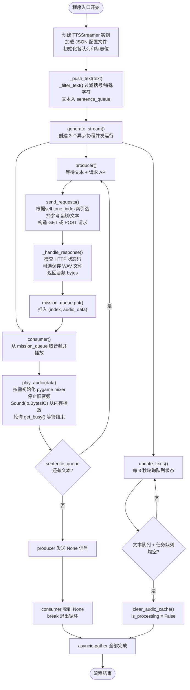
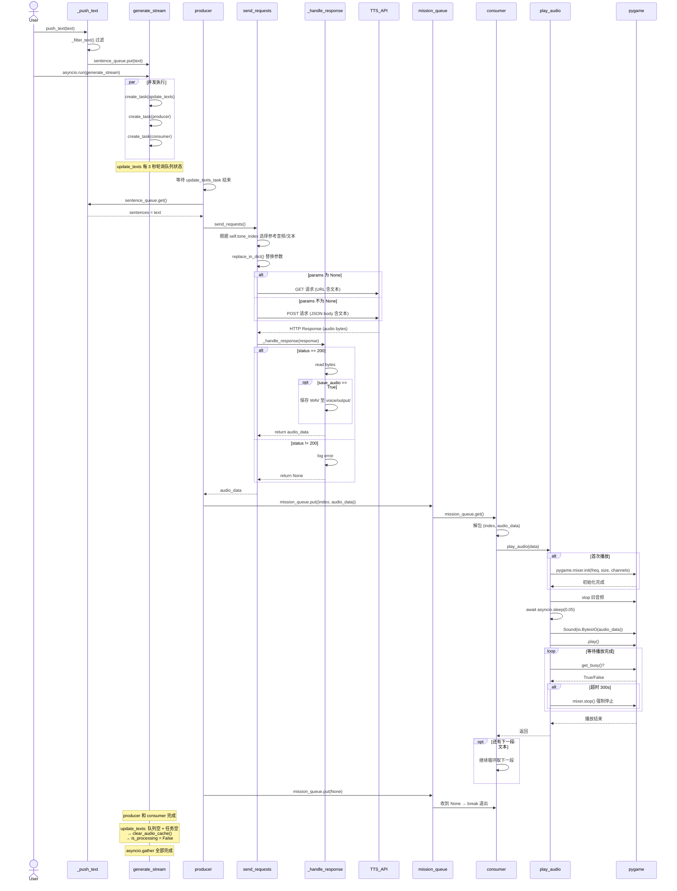
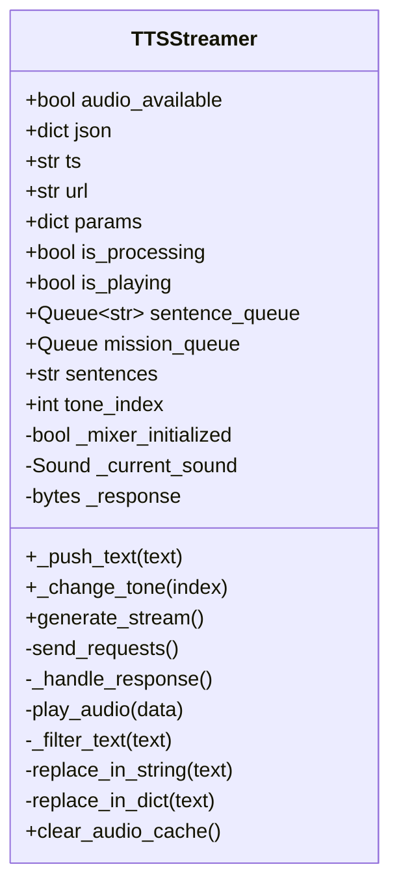

# customized_voice_service.py 流程图与时序图

---

## 一、流程图 (Flowchart)

---

## 二、时序图 (Sequence Diagram)

---

## 三、核心流程说明

| 阶段 | 方法 | 说明 |
|------|------|------|
| **初始化** | `__init__` | 加载 JSON 配置 (URL/参数/参考音频等)，初始化 `sentence_queue`(文本队列)、`mission_queue`(asyncio音频任务队列) |
| **文本入队** | `_push_text` → `_filter_text` | 外部调用，过滤括号/特殊字符后放入 `sentence_queue` |
| **流式启动** | `generate_stream` | 创建 3 个协程并发运行：`update_texts`(监控)、`producer`(生产者)、`consumer`(消费者) |
| **生产者** | `producer` | 等待 `update_texts_task` 结束；从 `sentence_queue` 取文本 → `send_requests()` → 音频入 `mission_queue` |
| **请求API** | `send_requests` | 根据 `self.tone_index` 选择参考音频/文本，构造 GET 或 POST 请求发送给 TTS 服务 |
| **处理响应** | `_handle_response` | 校验 HTTP 200 → 读 bytes → 可选保存 WAV 文件 → 返回音频数据 |
| **消费者** | `consumer` | 从 `mission_queue` 取 `(index, audio_data)` → 调用 `play_audio()` |
| **播放** | `play_audio` | 按需初始化 pygame mixer → 停止旧音频 → `Sound(io.BytesIO)` 从内存播放 → 轮询 `get_busy()` 等待结束 |
| **监控** | `update_texts` | 每3秒检查队列状态；队列空且任务完成时清除缓存、设置 `is_processing=False` |
| **终止信号** | `mission_queue.put(None)` | producer 结束后发送 None，consumer 收到后 break 退出循环 |

---

## 四、关键数据结构

