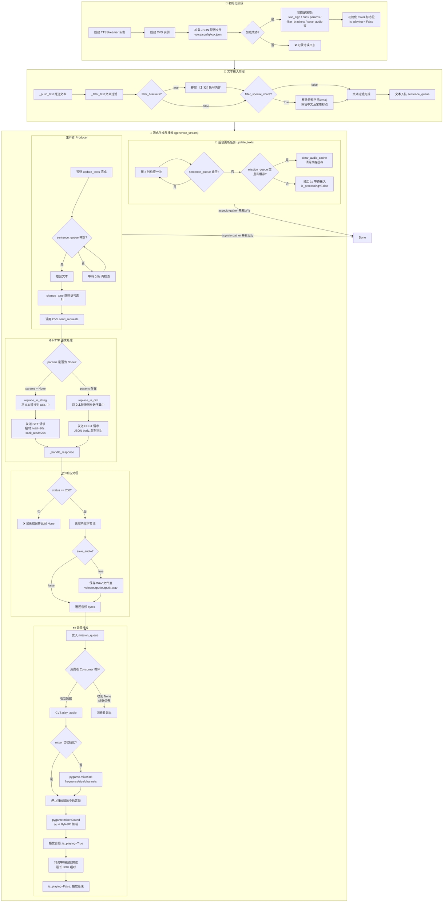
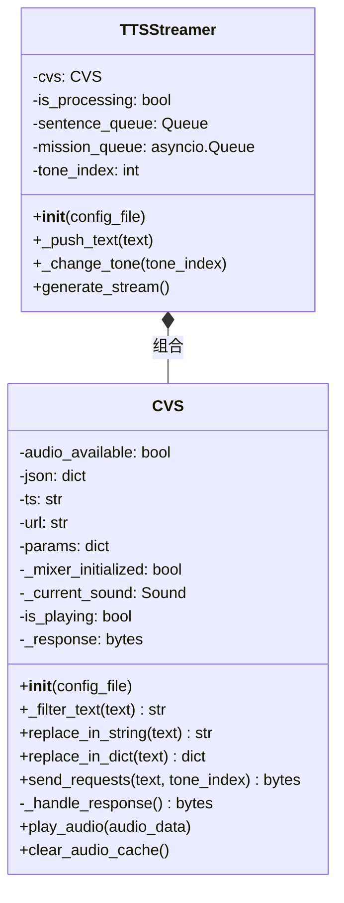
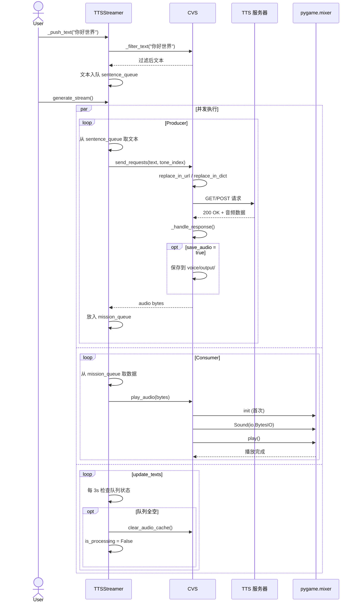

# customized_voice_service.py 运行原理

## 整体架构流程图

## 类关系图

## 数据流时序图

## 核心流程说明

| 阶段 | 说明 |
|------|------|
| **配置加载** | 从 `voice/config/xxx.json` 读取 TTS 服务 URL、参数、过滤规则等 |
| **文本过滤** | 根据配置移除括号内容 `【】[]`、emoji 及特殊字符，保留中文标点 |
| **文本替换** | 使用 `text_sign` 作为占位符，将实际文本替换到 URL(GET) 或参数字典(POST) 中 |
| **HTTP 请求** | 异步发送请求(30s 总超时)，支持 GET/POST 两种模式 |
| **响应处理** | 检查状态码，读取音频字节流，可选保存为 WAV 文件 |
| **音频播放** | 通过 pygame.mixer 从内存直接播放，无需落盘，支持停止当前播放 |
| **流式调度** | Producer-Consumer 模式 + 后台监控任务，三者通过 `asyncio.gather` 并发运行 |
